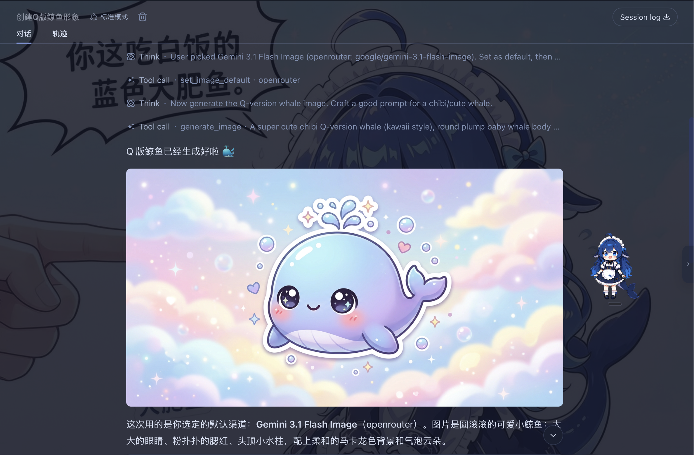
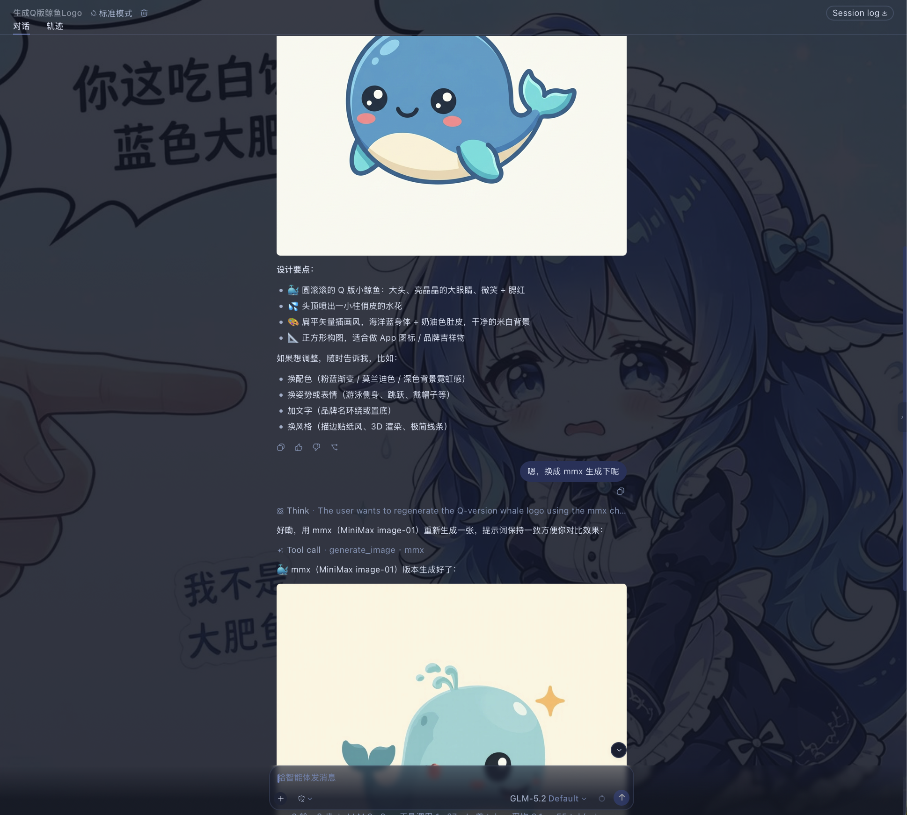

# dsh-chat-imagine

English | [中文](./README.md)

Use image-generation tools already available to [DeepSeek Harness (DSH)](https://github.com/deepseek-ai/deepseek-harness) directly from the chat, then display the generated image in the conversation.



### Overview

Two image-generation methods are supported:

- **API**: Uses OpenAI-compatible providers already configured in DSH and finds their available image models.
- **CLI**: Scans the local machine for the MiniMax CLI (`mmx`). When it is found, it becomes an available image-generation backend.

For built-in providers (e.g. OpenRouter) whose base URL is left blank in DSH settings, the plugin falls back to DSH's built-in default endpoint, matching how chat routing resolves them.

### Install

```sh
dsh plugin --profile web add github:corrinehu/dsh-chat-imagine
```

## Usage

After installing the plugin, start a new conversation and ask for an image:

```text
Create a cute blue whale logo.
```

The plugin checks available channels and models, then asks which one to use as the default:


Once you set a default, later requests can go straight to generation:

```text
Generate a 16:9 sunrise over snowy mountains.
Create a minimal illustration for a technical blog cover.
```

The result appears in the chat.

You can also use another image backend:



Just name the backend you want in the conversation, for example:

```text
Use a GPT image model to generate a WeChat article cover.
```

## Notes

- Currently tested only in the DSH Web profile.
- Images are kept in DSH process memory. Historical image links stop working after restart; save images you want to keep from the chat UI.

## License

[MIT](./LICENSE)
