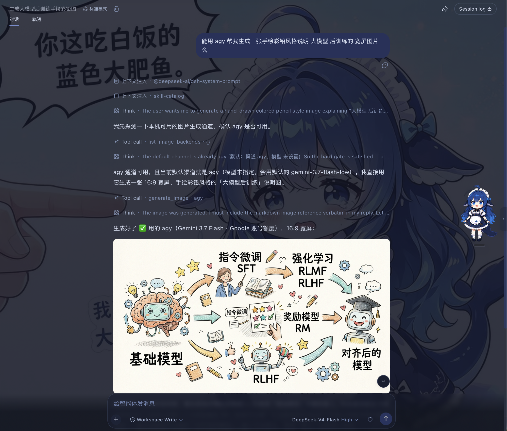

# dsh-chat-imagine

English | [中文](./README.md)

Automatically call image-generation tools from the [DeepSeek Harness (DSH)](https://github.com/deepseek-ai/deepseek-harness) chat window (via API channels, or the local CLIs: mmx / codex / agy), display the generated image inline, and also recognize images using the corresponding CLI.


## Overview

Two image-generation methods are supported:

### API

- Uses OpenAI-compatible providers already configured in DSH and finds their available image models.

- For built-in providers (e.g. OpenRouter) whose base URL is left blank in DSH settings, the plugin falls back to DSH's built-in default endpoint, matching how chat routing resolves them.

### CLI

The plugin scans the local machine for the MiniMax CLI (`mmx`), the OpenAI Codex CLI (`codex`), and the Google Antigravity CLI (`agy`); each one found becomes an available image-generation and image-recognition backend.

#### Image Generation

- Calling `codex` spends your **ChatGPT account (Plus/Pro) quota** rather than an API key. Requires the codex CLI installed and signed in to an account with image quota left (check with `codex login status`).
- Calling `agy` spends your **Google account quota**. Requires the agy CLI installed and signed in via the Antigravity app.
- When codex / agy is detected, the plugin also registers the skill **`cli-image-gen`**, which teaches the model to drive the CLIs for image generation when the `generate_image` tool fails (quota / region restrictions / parsing), and to finish with inline display via `show_image_file`.

#### Image Recognition

- Recognition uses the **same CLI channels' vision capabilities** (mmx's `vision describe`, codex's `exec -i` with image input + server-enforced JSON schema, agy's `--json-schema`). So **installing any one of mmx / codex / agy enables image recognition** — no need to install all three; if none is installed the plugin still works, only `analyze_image` returns a "CLI not found" notice.
- Reads an image (local path or http(s) URL) into **structured JSON evidence**: OCR full text and per-line text, reading-order layout regions, semantic entities and relations, visual notes, and an uncertainty list — any model (including text-only) can call it directly, with no vision-model switching.
- Channel auto-picks by speed (`mmx` → `codex` → `agy`); you can also pin a default with the `visionBackend` parameter of `set_image_default`.


## Install

```sh
dsh plugin --profile web add github:corrinehu/dsh-chat-imagine
```

## Usage

After installing the plugin, start a new conversation and ask for an image:

```text
Create a cute blue whale logo.
```

The plugin checks available channels and models, then asks which one to use as the default:


Once set, you don't need to choose again. Just describe the image you want in the chat:

```text
Generate a 16:9 sunrise over snowy mountains.
```

The result appears directly in the chat.

You can also use another image backend:


Just say so in the conversation, for example:

```text
Use agy to generate a widescreen hand-drawn colored-pencil diagram explaining LLM post-training.
```




## Image Recognition

Image recognition **requires a local CLI**: with any one of mmx / codex / agy installed, the `analyze_image` tool is available (any one suffices — no need to install all three); if none is installed the plugin still works, only image recognition is unavailable — calls return a "CLI not found" notice. Once a CLI is present, the tool reads an image (local path or http(s) URL) into **structured JSON evidence** — OCR full text and per-line text, layout regions in reading order, semantic entities and relations, visual notes, and an uncertainty list.

```text
Read this image /tmp/screenshots/error.png and copy out the error text verbatim.
```

- **Any model can use it**: the tool drives the vision models on the CLI channels (MiniMax VLM / ChatGPT / Gemini); the current session does not need to switch to a vision model — the key difference from route-taking-over solutions like modlens.
- **Contract ported from modlens**: the same five-part evidence structure, deliberately without bounding boxes and confidence (the two fields vision models most easily fabricate).
- **Channel selection**: `mmx` (fastest, direct VLM, ~3-8s) → `codex` (server-enforced JSON schema, most reliable) → `agy` (Gemini, weekly quota shared). Pin a default with the `visionBackend` parameter of `set_image_default`; otherwise it auto-picks by speed.
- **Graceful degradation**: when a channel runs out of quota, say in the conversation to switch (the `backend` parameter, or just "use codex").

## Notes

- Currently tested only in the DSH Web profile.
- Images are kept in DSH process memory. Historical image links stop working after restart; save images you want to keep from the chat UI.

## License

[MIT](./LICENSE)
